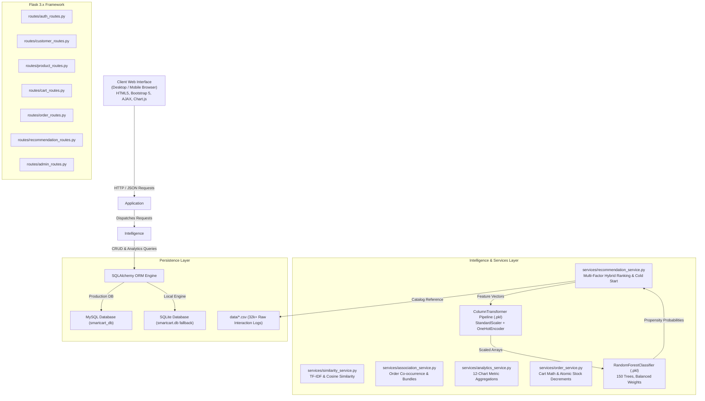

<div align="center">

# SMARTCART
### AI-Powered Personalized E-Commerce Recommendation System

[](https://www.python.org/)
[](https://flask.palletsprojects.com/)
[](https://scikit-learn.org/)
[](https://pandas.pydata.org/)
[](https://numpy.org/)
[](https://getbootstrap.com/)
[](https://www.chartjs.org/)
[](LICENSE)

<p align="center">
  A production-ready e-commerce platform integrating a <b>Random Forest Classifier</b> for purchase likelihood prediction, <b>Multi-Factor Hybrid Scoring</b>, <b>TF-IDF Cosine Similarity</b>, and <b>Market Basket Co-Occurrence Analysis</b> with an executive 12-chart real-time analytics suite.
</p>

[Key Features](#key-features) •
[System Architecture](#system-architecture) •
[Machine Learning Pipeline](#machine-learning-architecture) •
[Dataset Documentation](#dataset-documentation) •
[Recommendation Algorithms](#recommendation-engine) •
[Installation Guide](#installation--setup) •
[API Reference](#api-reference) •
[Demo Credentials](#demo-credentials)

</div>

---

## 1. Project Overview

Modern e-commerce platforms confront critical conversion bottlenecks:
- **Information Overload**: Catalogs featuring hundreds or thousands of products overwhelm shoppers, leading to decision fatigue and high cart abandonment.
- **Generic Recommendations**: Uncalibrated "popular" lists disregard demographic affinities, price preferences, and recent search intent.
- **Disconnected Cross-Selling**: Manual cross-sell rules fail to capture real-time basket co-occurrence and accessory pairings.

### How SmartCart Solves These Problems
**SmartCart** bridges behavioral telemetry with machine learning to construct a personalized shopping journey:
1. **Purchase Propensity Estimation**: A trained **Random Forest Classifier** evaluates customer demographics and interaction vectors to predict purchase probabilities without target data leakage.
2. **Multi-Factor Hybrid Ranking**: Combines ML purchase probability with declared category preferences, historical spend, popularity indices, customer ratings, and session search relevance.
3. **Explainable AI (XAI)**: Displays contextual reasons directly on recommendation badges (*"Because you viewed Bluetooth Speakers"*, *"Matches your preference for Electronics"*).
4. **Market Basket Bundles**: Frequently Bought Together algorithm dynamically analyzes order co-occurrences, bundling complementary items with automatic 10% bundle discounts.
5. **Full E-Commerce Lifecycle**: Search, multi-facet filtering, AJAX cart management, demo checkout, order tracking, and an executive admin suite backed by 12 real database-driven Chart.js charts.

---

## 2. Key Features

### Customer Experience & E-Commerce Flow
- **Session Authentication & Role Access**: Secure user registration, login, and session persistence using Werkzeug password hashing (`pbkdf2:sha256`).
- **Real-Time Autocomplete Search**: Debounced instant keyword search across product names, categories, brands, tags, and descriptions.
- **Multi-Faceted Filtering & Sorting**: Filter products by Category, Brand, Price Slider, Customer Rating (3.5★, 4.0★+), and Stock Availability. Sort by Relevance, Price, Rating, Popularity, or Newest.
- **Interactive Shopping Cart**: AJAX-driven quantity stepper (`+` / `-`), line-item recalculation, delivery threshold calculations (Free Delivery over ₹1,000), and item removal.
- **Frequently Bought Together 1-Click Bundling**: Interactive checkboxes, combined bundle price, discount savings calculations, and a 1-click **Add All to Cart** feature.
- **Content-Based Similar Products**: Cosine similarity carousel on every product detail page.
- **Multi-Step Checkout & Order Tracking**: Realistic checkout with delivery address entry, simulated payment methods (UPI, Credit/Debit Card, Net Banking, COD), order confirmation timeline, and status updates.
- **Customer Shopping Insights**: Personalized analytics on the customer dashboard (*"You shop mostly in Electronics. Your average order value is ₹3,240"*).
- **Dark / Light Theme Toggle**: User preference saved and persisted across sessions using browser `localStorage`.

### Administrator & Intelligence Suite
- **KPI Summary Cards**: Total Customers, Total Products, Total Orders, Total Revenue, Today's Orders, Today's Revenue, AOV, and Conversion Rate.
- **12 Database-Driven Analytics Charts (Chart.js)**: Daily Sales (14 days), Monthly Revenue (6 months), Orders Over Time, Sales by Category, Top 5 Products by Revenue, Customer Growth, Interaction Funnel, Add-to-Cart Rate, Conversion Rate, Recommendation CTR, Recommendation CVR, and Daily AOV.
- **Recommendation Telemetry Dashboard**: Real-time impressions, click-through rates (CTR), conversion rates (CVR), most recommended products, and strategy breakdown.
- **Machine Learning Analytics**: Model hyperparameters, 80/20 train/test splits, real measured metrics (Accuracy, Precision, Recall, F1, ROC-AUC), graphical Confusion Matrix, and Feature Importance bar charts.
- **1-Click AI Model Retraining**: Retrains the Random Forest classifier on latest interaction records, recalculates evaluation metrics, and updates memory live without server restarts.
- **Catalog & Order Management**: Full CRUD modals for products, stock/price updates, customer directory, and order status updates (`Placed` $\rightarrow$ `Confirmed` $\rightarrow$ `Packed` $\rightarrow$ `Shipped` $\rightarrow$ `Delivered` $\rightarrow$ `Cancelled`).
- **Dataset Explorer & CSV Export**: Real-time database entity counters, missing value checks, sample previews, and downloadable interaction dataset CSV export.

---

## 3. System Architecture



For a deeper dive into architecture and sequence diagrams, refer to [docs/architecture.md](docs/architecture.md).

---

## 4. Machine Learning Architecture

The predictive engine (`preprocessing.py` and `train_model.py`) estimates the likelihood that a customer will purchase a given product:

$$\hat{y} = P(\text{Purchased} = 1 \mid X)$$

### 1. Data Leakage Prevention
Features are strictly derived from demographic profiles and pre-purchase behavioral patterns. Current transaction IDs (`Purchase_ID`, `Order_ID`) and post-order details are omitted from feature vectors.

### 2. Feature Pipeline
Input vectors are transformed through a Scikit-Learn `ColumnTransformer`:
- **Numerical Features** (`StandardScaler`): `Age`, `Product_Price`, `Discount`, `Product_Rating`, `Review_Count`, `Popularity_Score`, `Previous_Purchases`, `Category_Purchase_Count`, `Product_View_Count`, `Wishlist_Count`, `Cart_Count`, `Average_Order_Value`, `Search_Relevance`, `Historical_Product_Rating`.
- **Categorical Features** (`OneHotEncoder`): `Gender`, `Preferred_Category`, `Category`, `Subcategory`.

### 3. Model Configuration & Hyperparameters
- **Algorithm**: `sklearn.ensemble.RandomForestClassifier`
- **Number of Estimators**: `150`
- **Max Depth**: `12`
- **Min Samples Split**: `8`
- **Min Samples Leaf**: `4`
- **Class Weight**: `"balanced"` (handles class distribution skew)
- **Random State**: `42`
- **Parallel Jobs**: `n_jobs=-1`

### 4. Real Measured Evaluation Results
Evaluated on an **80/20 Stratified Test Set** (25,602 training samples, 6,401 test samples) recorded in `models/model_metrics.json`:

| Metric | Measured Value | Meaning |
| :--- | :---: | :--- |
| **Accuracy** | **78.58%** | Correct overall purchase/non-purchase predictions |
| **Precision** | **38.92%** | Precision of positive purchase classifications |
| **Recall** | **99.54%** | Successfully captures 99.5% of all actual purchase events |
| **F1 Score** | **55.96%** | Harmonic mean balancing precision and recall |
| **ROC-AUC** | **0.8696** | High discriminative power between purchase and non-purchase intent |

### Measured Confusion Matrix:
$$\begin{pmatrix} \text{TN} = 4,159 & \text{FP} = 1,367 \\ \text{FN} = 4 & \text{TP} = 871 \end{pmatrix}$$

### Measured Feature Importance:
1. `Cart_Count`: **43.33%**
2. `Product_View_Count`: **42.16%**
3. `Category`: **3.49%**
4. `Preferred_Category`: **2.26%**
5. `Subcategory`: **1.76%**
6. `Wishlist_Count`: **1.71%**
7. `Category_Purchase_Count`: **0.90%**
8. `Product_Price`: **0.81%**
9. `Average_Order_Value`: **0.74%**
10. `Age`: **0.60%**

For complete mathematical derivations and feature explanations, see [docs/machine-learning.md](docs/machine-learning.md).

---

## 5. Dataset Documentation

All datasets are generated autonomously via `generate_dataset.py` without external dependencies and stored in `data/`:

| File | Records | Size | Description |
| :--- | :---: | :---: | :--- |
| `data/products.csv` | **630** | ~273 KB | Catalog items across 15 categories with pricing, stock, ratings, and tags |
| `data/customers.csv` | **3,000** | ~305 KB | Customer profiles with age, gender, city, state, preferred category, and spend |
| `data/interactions.csv` | **32,003** | ~3.4 MB | Action logs (`View`, `Search`, `Wishlist`, `Cart`, `Purchase`, `Rating`) with durations |
| `data/purchases.csv` | **3,060** | ~357 KB | Multi-item checkout transactions with payment methods |
| `data/search_history.csv` | **5,638** | ~641 KB | Search queries, categories, and click-through results |
| `data/ratings.csv` | **1,313** | ~124 KB | Verified reviews with integer ratings (1–5) and review feedback |

### 15 Product Categories:
`Electronics`, `Mobiles`, `Laptops`, `Fashion`, `Footwear`, `Beauty`, `Home`, `Kitchen`, `Furniture`, `Sports`, `Books`, `Gaming`, `Accessories`, `Grocery`, `Personal Care`.

### Behavioral Generation Rules:
- **Demographic Affinity**: Younger users (18–32) exhibit higher propensity for `Electronics`, `Gaming`, and `Fashion`; older age groups engage more with `Home`, `Kitchen`, and `Books`.
- **Conversion Probabilities**: $P(\text{Wishlist}) = 0.22$, $P(\text{Cart}) = 0.35$, $P(\text{Purchase} \mid \text{Cart}) = 0.58$.
- **Basket Co-occurrences**: Co-purchase probability increases for complementary pairings (e.g. Laptops + Laptop Bags + Mice; Mobiles + Phone Cases + Tempered Glass).

For full column definitions and types, see [docs/dataset.md](docs/dataset.md).

---

## 6. Recommendation Engine

SmartCart employs four dedicated recommendation strategies:

### 1. Personalized Multi-Factor Scoring
Calculates a balanced composite score $S(u, i)$:

$$S(u, i) = 0.50 \cdot P_{\text{ML}} + 0.15 \cdot C_{\text{pref}} + 0.10 \cdot H_{\text{hist}} + 0.10 \cdot P_{\text{pop}} + 0.10 \cdot R_{\text{rate}} + 0.05 \cdot Q_{\text{search}}$$

- Normalized to a visible percentage: $\text{Match \%} = \min(99, \max(62, \text{round}(S \times 100)))$.
- Badge thresholds:
  - $\ge 88\%$: **AI Recommended** (`bg-primary`)
  - $76\% - 87\%$: **Highly Relevant** (`bg-success`)
  - $< 76\%$: **Recommended** (`bg-info`)
- Generates dynamic Explainable AI (XAI) reason strings.

### 2. Similar Products Engine
Uses Scikit-Learn `TfidfVectorizer` over combined product metadata (`Category`, `Subcategory`, `Brand`, `Tags`, `Description`) to compute pairwise cosine similarities, rendering the top 6 similar products.

### 3. Frequently Bought Together (Co-Occurrence)
Constructs a co-occurrence matrix from multi-item order histories:
$$C(i, j) = \sum_{o \in \text{Orders}} \mathbb{I}(i \in o \land j \in o)$$
Bundles primary products with top co-purchased accessories and calculates an automatic **10% bundle discount** with 1-click checkout.

### 4. Cold-Start Fallback Strategy
For new visitors with no history, candidates are ranked by popularity scores and verified ratings ($\ge 4.0\star$), with category diversity constraints preventing single-category dominance.

### 5. Recommendation Telemetry Loop
Tracks impressions (`shown_at`), clicks (`clicked = 1`), and purchases (`purchased = 1`) in `recommendations` table to calculate real-time Recommendation CTR and CVR on the admin dashboard.

For detailed algorithmic walkthroughs, see [docs/recommendation-engine.md](docs/recommendation-engine.md).

---

## 7. Database Architecture

SmartCart uses SQLAlchemy with support for both MySQL and SQLite:

| Table | Purpose | Key Relationships |
| :--- | :--- | :--- |
| `users` | Account credentials & authentication | `1:1` with `customers` |
| `customers` | Customer profiles & lifetime spending stats | `1:N` with `orders`, `wishlists`, `interactions` |
| `categories` | Retail categories and descriptions | Taxonomy reference |
| `products` | Master catalog items, pricing, stock, ratings | `1:N` with `order_items`, `cart_items` |
| `orders` | Transaction records and shipping addresses | `1:N` with `order_items` |
| `order_items` | Item-level order units, prices, discounts | `N:1` with `orders`, `N:1` with `products` |
| `cart` | Active customer and session carts | `1:N` with `cart_items` |
| `cart_items` | Line items currently in shopping cart | `N:1` with `cart`, `N:1` with `products` |
| `interactions` | Behavioral telemetry stream (view, cart, buy) | `N:1` with `customers`, `N:1` with `products` |
| `search_history` | Query logs, categories, clicked items | `N:1` with `customers` |
| `ratings` | Star reviews and customer feedback | `N:1` with `customers`, `N:1` with `products` |
| `wishlists` | Customer saved favorite items | `N:1` with `customers`, `N:1` with `products` |
| `recommendations` | Impression, click, and conversion telemetry | Telemetry log |
| `notifications` | In-app customer alerts and updates | `N:1` with `customers` |

Complete entity-relationship diagrams and field schemas are documented in [docs/database.md](docs/database.md).

---

## 8. API Reference

| Method | Endpoint | Description | Auth Required |
| :--- | :--- | :--- | :---: |
| `POST` | `/api/login` | Authenticate customer or admin | No |
| `POST` | `/api/register` | Register customer with preferences | No |
| `POST` | `/api/logout` | Terminate active session | Yes |
| `GET` | `/api/products` | Paginated product catalog | No |
| `GET` | `/api/products/<product_id>` | Detailed product specifications | No |
| `GET` | `/api/search/suggestions` | Instant autocomplete search results | No |
| `GET` | `/api/recommendations` | Personalized ML recommendations | No (Fallback to Cold Start) |
| `GET` | `/api/recommendations/similar/<id>` | Top 6 cosine similar products | No |
| `GET` | `/api/recommendations/frequently-bought/<id>` | Co-occurrence bundle & pricing | No |
| `POST` | `/api/recommendations/track` | Telemetry click & purchase tracker | No |
| `GET` | `/api/cart` | Active cart items and summary | No |
| `POST` | `/api/cart/add` | Add single item or bundle array | No |
| `POST` | `/api/cart/update` | Increment/decrement item quantity | No |
| `POST` | `/api/cart/remove` | Remove item from cart | No |
| `GET` | `/api/cart/count` | Total active cart item count | No |
| `POST` | `/api/wishlist/toggle` | Toggle product in customer wishlist | Yes |
| `GET` | `/api/orders` | Customer order history | Yes |
| `POST` | `/api/orders` | Place demo order and clear cart | No |
| `GET` | `/admin/api/analytics/charts` | 12 Chart.js dataset aggregations | Yes (`admin`) |
| `POST` | `/api/retrain` | Retrain Random Forest model | Yes (`admin`) |

Complete request and response JSON schemas are documented in [docs/api.md](docs/api.md).

---

## 9. User & Administrator Workflows

### Customer Shopping Workflow:
```
Home Page / Browse ──> Search & Filter ──> View Product Details
                                                   │
  ┌────────────────────────────────────────────────┴───────────────────────────────┐
  ▼                                                ▼                               ▼
AI Recommendations                          Similar Products             Frequently Bought Together
  │                                                │                               │
  └────────────────────────┬───────────────────────┘                               ▼
                           ▼                                            1-Click Add All to Cart
                      Add to Cart (AJAX)                                           │
                           │                                                       ▼
                           └───────────────────────┬───────────────────────────────┘
                                                   ▼
                                           Review Cart Page
                                                   │
                                                   ▼
                                       Checkout & Demo Payment
                                       (UPI / Card / NetBanking)
                                                   │
                                                   ▼
                                        Order Confirmed (ID Issued)
                                                   │
                                                   ▼
                                        Updated Customer History
                                    (Refined Future Recommendations)
```

### Administrator Management Workflow:
```
Admin Login (admin@smartcart.com)
     │
     ├──> Dashboard (8 Real-Time KPI Cards & Product Insights)
     ├──> Sales & Conversion Analytics (12 Dynamic Chart.js Visualizations)
     ├──> Recommendation Analytics (CTR, CVR, Top Converted Products)
     ├──> Machine Learning Intelligence (Confusion Matrix, Feature Importance)
     │         │
     │         └──> Retrain AI Model Button (Live Model & Preprocessor Reload)
     ├──> Product Management (Catalog CRUD, Stock Adjustments, Price Updates)
     ├──> Order Fulfillment (Status progression: Placed ➔ Shipped ➔ Delivered)
     └──> Dataset Explorer (Integrity Checks & CSV Export Download)
```

---

## 10. Technology Stack

| Layer | Technologies Used | Purpose |
| :--- | :--- | :--- |
| **Frontend Framework** | HTML5, CSS3, JavaScript (ES6+ Fetch API) | Responsive client interface |
| **Styling & Icons** | Bootstrap 5.3.3, Bootstrap Icons 1.11.3 | UI components, modals, toasts, dark theme |
| **Data Visualization** | Chart.js 4.4 | 12 dynamic interactive analytics charts |
| **Backend Framework** | Python 3.14, Flask 3.1.3, Werkzeug 3.1.8 | WSGI routing, sessions, templates, APIs |
| **Machine Learning** | Scikit-Learn 1.9.0, Joblib 1.6.0 | Random Forest, ColumnTransformer, Scaler |
| **Data Engineering** | Pandas 3.0.5, NumPy 2.5.2 | Tabular transformations, statistical distributions |
| **Database & ORM** | SQLAlchemy 2.0.52, Flask-SQLAlchemy 3.1.1 | Object-relational mapping, transactional safety |
| **Database Drivers** | PyMySQL 1.2.0, SQLite3 | MySQL connectivity with local fallback |
| **Testing Framework** | Python `unittest` | 12 automated unit and integration tests |

---

## 11. Installation & Setup

### 1. Prerequisites
- Python 3.10+ (tested on Python 3.14)
- Git

### 2. Clone the Repository
```bash
git clone https://github.com/vishveshvar/SMARTCART.git
cd SMARTCART
```

### 3. Create & Activate a Virtual Environment
```bash
# Windows:
python -m venv venv
.\venv\Scripts\activate

# Linux / macOS:
python3 -m venv venv
source venv/bin/activate
```

### 4. Install Dependencies
```bash
pip install -r requirements.txt
```

### 5. (Optional) Configure Environment Variables
Copy `.env.example` to `.env`:
```bash
copy .env.example .env
```
*(SmartCart runs out-of-the-box using the built-in SQLite engine if no `.env` is configured).*

### 6. Generate Data, Train Model & Seed Database
*(Run these if initializing from a clean environment; pre-generated files and trained models are already present in the repository)*:
```bash
# Step 1: Generate 32k+ interaction dataset:
python generate_dataset.py

# Step 2: Train Random Forest Classifier & evaluate metrics:
python train_model.py

# Step 3: Populate database and demo credentials:
python seed_db.py
```

### 7. Run the Application
```bash
python app.py
```

Open your browser at:
**`http://127.0.0.1:5000`**

For complete deployment and platform-specific guides, see [docs/installation.md](docs/installation.md).

---

## 12. Demo Credentials

Pre-configured demo credentials initialized in the database:

| Role | Email Address | Password | Privileges / Context |
| :--- | :--- | :--- | :--- |
| **Customer** | `customer@smartcart.com` | `Customer@123` | 28yo Male, Preferred Category: **Electronics**, 8 prior orders |
| **Admin** | `admin@smartcart.com` | `Admin@123` | Full access to Admin Portal, Analytics, Retraining, CRUD |

*(Note: The login screen includes 1-click quick-fill buttons for both accounts).*

---

## 13. Automated Testing

SmartCart includes 12 automated integration and unit test cases covering authentication, recommendations, cart operations, checkout, telemetry, and admin management:

```bash
python -m unittest tests/test_smartcart.py
```

### Verified Test Output:
```
............
----------------------------------------------------------------------
Ran 12 tests in 2.297s

OK
```

---

## 14. Project Structure

```
SMARTCART/
├── app.py                            # Flask application factory and entry point
├── config.py                         # Application configuration & database URI logic
├── database.py                       # SQLAlchemy database initialization
├── models.py                         # Complete database schemas and relationships
├── requirements.txt                  # Python dependencies
├── README.md                         # Main repository documentation
├── generate_dataset.py               # Synthetic behavioral dataset generator
├── preprocessing.py                  # Scikit-learn Pipeline & ColumnTransformer
├── train_model.py                    # Random Forest training & evaluation script
├── seed_db.py                        # Database seeder (products, users, demo accounts)
├── schema.sql                        # Standalone MySQL DDL schema
├── .gitignore                        # Git exclusion rules
├── .env.example                      # Environment variables template
├── LICENSE                           # MIT License
│
├── data/                             # Generated synthetic datasets
│   ├── customers.csv                 # 3,000 customer records
│   ├── products.csv                  # 630 retail products across 15 categories
│   ├── interactions.csv              # 32,003 interaction records
│   ├── purchases.csv                 # 3,060 purchase records (multi-item orders)
│   ├── search_history.csv            # 5,638 search queries and clicks
│   └── ratings.csv                   # 1,313 customer reviews and star ratings
│
├── models/                           # Trained ML artifacts
│   ├── smartcart_random_forest.pkl   # Serialized RandomForestClassifier
│   ├── preprocessing_pipeline.pkl    # Serialized ColumnTransformer/Scaler
│   └── model_metrics.json            # Real calculated evaluation metrics
│
├── services/                         # Business & AI service layer
│   ├── recommendation_service.py     # Random Forest inference & hybrid scoring
│   ├── similarity_service.py         # TF-IDF & Cosine similarity engine
│   ├── association_service.py        # Co-occurrence market basket analysis
│   ├── analytics_service.py          # 12 Chart.js analytics & KPI aggregations
│   └── order_service.py              # Cart management, checkout & spend tracking
│
├── routes/                           # Modular blueprint controllers
│   ├── auth_routes.py                # Authentication, sessions, & role protection
│   ├── customer_routes.py            # Home, customer dashboard, profile, wishlist
│   ├── product_routes.py             # Live search, filters, details, & API
│   ├── cart_routes.py                # AJAX cart addition, quantity stepper, remove
│   ├── order_routes.py               # Checkout, order confirmation, & history
│   ├── recommendation_routes.py      # Recommendation APIs & click telemetry
│   └── admin_routes.py               # Admin dashboard, 12 charts, ML retrain, CRUD
│
├── templates/                        # Jinja2 templates
│   ├── base.html                     # Core layout, search bar, dark mode, footer
│   ├── login.html                    # Sign in card with 1-click demo login buttons
│   ├── register.html                 # Registration with demographic fields
│   ├── home.html                     # Hero, AI Recommended, Trending, Bestsellers
│   ├── search.html                   # Multi-facet filter sidebar & sorting grid
│   ├── product.html                  # Product details, FBT bundle, Similar items
│   ├── cart.html                     # Itemized cart with live quantity controls
│   ├── checkout.html                 # Multi-step checkout & payment methods
│   ├── order_confirmation.html       # Confirmation, order ID, delivery timeline
│   ├── orders.html                   # Customer order history table
│   ├── order_details.html            # Order receipt & shipment breakdown
│   ├── wishlist.html                 # Wishlist with 1-click move to cart
│   ├── profile.html                  # Profile settings & "Shopping Insights"
│   │
│   └── admin/                        # Admin portal templates
│       ├── dashboard.html            # 8 KPI cards, recent orders, product insights
│       ├── analytics.html            # 12 real database Chart.js analytics graphs
│       ├── recommendations.html      # Recommendation CTR, CVR, & strategy stats
│       ├── ml_analytics.html         # Graphical Confusion Matrix, Feature Importance
│       ├── products.html             # Product management & CRUD modals
│       ├── customers.html            # Customer directory & lifetime spend stats
│       ├── orders.html               # Order fulfillment & status updater
│       └── dataset.html              # Dataset explorer, health metrics, CSV export
│
├── static/                           # Static assets
│   ├── css/
│   │   ├── style.css                 # Base theme, CSS variables, dark mode
│   │   ├── ecommerce.css             # Product cards, badges, bundles, stepper
│   │   ├── dashboard.css             # Stat cards, chart containers, confusion matrix
│   │   └── responsive.css            # Tablet and mobile breakpoints
│   │
│   └── js/
│       ├── main.js                   # Dark/light toggle, toast notifications
│       ├── cart.js                   # AJAX cart updates & 1-click bundle checkout
│       ├── search.js                 # Autocomplete search suggestions
│       ├── recommendations.js        # Recommendation telemetry click tracking
│       ├── dashboard.js              # Admin modal controllers
│       └── charts.js                 # Dynamic Chart.js renderers for 12 charts
│
├── docs/                             # Deep-dive technical documentation
│   ├── architecture.md               # System & sequence diagrams
│   ├── machine-learning.md           # ML pipeline, metrics, confusion matrix
│   ├── dataset.md                    # Data dictionary & generation rules
│   ├── recommendation-engine.md      # Algorithm formulations & telemetry loop
│   ├── api.md                        # Full REST API schemas
│   ├── database.md                   # ER diagram & schema definitions
│   └── installation.md               # Cross-platform installation guide
│
└── tests/
    └── test_smartcart.py             # 12 automated unit and integration test cases
```

---

## 15. Screenshots & Visual Interface

| Interface | Description | Placeholder / Path |
| :--- | :--- | :--- |
| **Home Page** | Hero banner, category chips, AI Recommended carousel | `docs/screenshots/home.png` |
| **AI Recommendation Card** | Percentage Match badge, Explainable AI reason | `docs/screenshots/rec_card.png` |
| **Product Details** | Gallery, specifications, stock status | `docs/screenshots/product.png` |
| **Frequently Bought Together** | Co-occurrence bundle, checkboxes, bundle savings | `docs/screenshots/bundle.png` |
| **Shopping Cart** | Itemized table, quantity steppers, order summary | `docs/screenshots/cart.png` |
| **Checkout & Confirmation** | Multi-step form, delivery date, confirmed order ID | `docs/screenshots/checkout.png` |
| **Customer Insights** | Lifetime spend metrics, personalized shopping tips | `docs/screenshots/profile.png` |
| **Admin Dashboard** | 8 KPI cards, quick actions, recent orders | `docs/screenshots/admin_dashboard.png` |
| **12-Chart Analytics** | Real-time database timeseries, funnel, conversion charts | `docs/screenshots/admin_analytics.png` |
| **ML Intelligence** | Measured metrics, Confusion Matrix, Feature Importance | `docs/screenshots/admin_ml.png` |

---

## 16. Security & Data Integrity

- **Password Hashing**: Implemented with `werkzeug.security.generate_password_hash` (`pbkdf2:sha256`) with unique salts.
- **Role-Based Authorization**: Protected route decorators (`@login_required`, `@admin_required`) strictly restrict customer access from admin functions.
- **SQL Injection Prevention**: SQLAlchemy parameterized query compilation across all filter, search, and retrieval pipelines.
- **Server-Side Pricing Validation**: Cart prices and order totals are recalculated on the server directly from catalog records; client-submitted totals are not trusted.
- **Data Leakage Safeguards**: Strict omission of order transaction IDs and post-purchase signals during model training.

---

## 17. Limitations & Future Roadmap

### Current Limitations:
- **Text Representations**: Content similarity currently relies on TF-IDF vectorization rather than dense multimodal neural embeddings.
- **Payment Processing**: Payment options simulate instant confirmation rather than integrating live third-party payment gateways.

### Future Roadmap:
- **Deep Learning Recommenders**: Implementing Two-Tower Neural Networks or Wide & Deep architectures for sub-second vector retrieval.
- **Multimodal Embeddings**: Incorporating CLIP or Vision Transformers (ViT) to recommend products based on combined image and text aesthetics.
- **Real-Time Stream Processing**: Connecting clickstream events to Apache Kafka or Redis Streams for sub-minute online model updates.
- **Production Payment Gateways**: Integrating Stripe or Razorpay webhooks for live currency settlement.

---

## 18. Contributing

Contributions are welcome! Please follow standard open-source conventions:
1. Fork the repository (`https://github.com/vishveshvar/SMARTCART.git`).
2. Create a feature branch: `git checkout -b feature/NewFeature`.
3. Commit changes: `git commit -m "feat: add NewFeature"`.
4. Push to branch: `git push origin feature/NewFeature`.
5. Open a Pull Request.

---

## 19. License

This project is licensed under the [MIT License](LICENSE).
