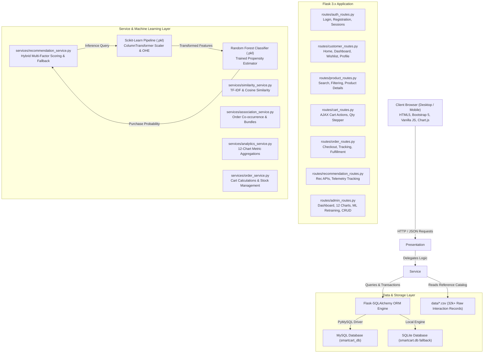
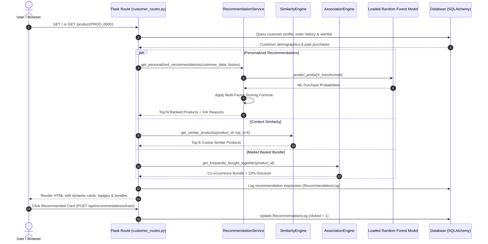

# System Architecture & Technical Design

This document details the software architecture, data flow, component interactions, and engineering patterns implemented in **SmartCart**.

---

## 1. High-Level Architecture

SmartCart adopts a modular multi-tier architecture separating client presentation, routing, business services, machine learning inference, and data persistence.

---

## 2. Request Lifecycle & Recommendation Sequence

When a customer visits the home page or product details page, the recommendation pipeline executes in sub-second time without expensive offline re-computations:

---

## 3. Component Responsibilities

### 1. Application Controller (`app.py`)
- Initializes Flask with configuration loaded from `config.py`.
- Mounts 7 modular blueprints (`auth_bp`, `customer_bp`, `product_bp`, `cart_bp`, `order_bp`, `recommendation_bp`, `admin_bp`).
- Context processor automatically injects active cart item counts, wishlist badge numbers, and category navigation lists into all templates.
- Configures custom error pages (404 Not Found, 500 Internal Error) without leaking sensitive stack traces.

### 2. Service Layer (`services/`)
- **`recommendation_service.py`**: Singleton engine keeping the serialized Random Forest model and preprocessor pipeline in memory for sub-second vector inference. Combines model purchase propensity with category preference, popularity, and ratings.
- **`similarity_service.py`**: Computes pairwise cosine similarities across product descriptions, tags, brands, and subcategories using TF-IDF.
- **`association_service.py`**: Parses multi-item transactions to build co-occurrence frequency matrices for Frequently Bought Together bundle generation.
- **`analytics_service.py`**: Extracts real-time KPI metrics, interaction funnels, conversion rates, and 14-day sales trends for Chart.js.
- **`order_service.py`**: Calculates cart subtotals, item-level discounts, delivery thresholds, handles order insertion, and decrements product inventory atomically.

### 3. Client Layer (`static/` & `templates/`)
- Pure HTML5 + Jinja2 templating with Bootstrap 5.3 framework.
- Theme switching mechanism storing dark/light mode preference in `localStorage`.
- Asynchronous JavaScript (`fetch` API) for non-blocking add-to-cart, quantity changes, live search suggestions, and telemetry tracking.
