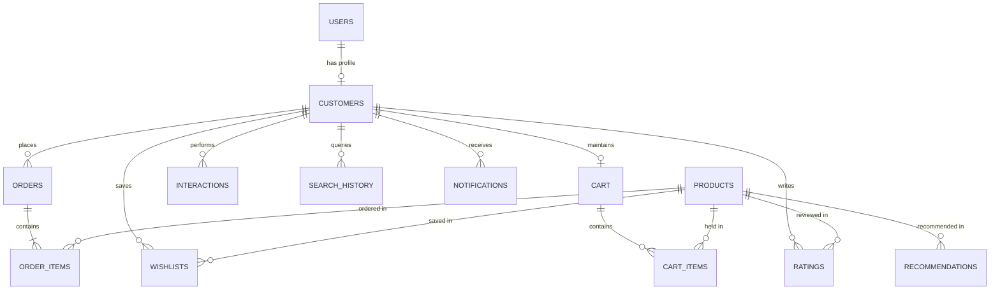

# Database Architecture & Schema Design

This document details the database architecture, entity relationships, schemas, and persistence layer implemented in **SmartCart**.

---

## 1. Persistence Layer Overview

SmartCart uses **SQLAlchemy 2.0** via **Flask-SQLAlchemy 3.1** as its Object-Relational Mapper (ORM).

### Dual-Engine Compatibility:
1. **MySQL 8.0+ Production (`smartcart_db`)**: Configured via `PyMySQL` driver. A standalone DDL creation script is provided in `schema.sql`.
2. **SQLite Zero-Config Engine (`smartcart.db`)**: Provides an automatic local fallback ensuring immediate execution without requiring an active MySQL daemon.



---

## 2. Table Schemas & Definitions

### 1. `users`
Stores user credentials, role-based authorization levels, and registration timestamps.
- `id` (INT, PK, Auto-increment)
- `email` (VARCHAR(120), Unique, Indexed)
- `password_hash` (VARCHAR(256)) — Generated via `werkzeug.security.generate_password_hash` (`pbkdf2:sha256`)
- `role` (VARCHAR(20), Default: `'customer'`) — Values: `'customer'`, `'admin'`
- `created_at` (DATETIME, Default: UTC Now)

---

### 2. `customers`
Demographic profile and aggregated spending behavior linked to `users`.
- `id` (INT, PK)
- `customer_id` (VARCHAR(50), Unique, Indexed, e.g. `CUST_00001`)
- `user_id` (INT, FK $\rightarrow$ `users.id`, Cascading Delete)
- `name` (VARCHAR(100))
- `email` (VARCHAR(120))
- `age` (INT, Default: 30)
- `gender` (VARCHAR(20))
- `city` (VARCHAR(100))
- `state` (VARCHAR(100))
- `preferred_category` (VARCHAR(100))
- `average_order_value` (FLOAT)
- `total_purchases` (INT)
- `purchase_frequency` (FLOAT)
- `average_rating_given` (FLOAT)
- `last_purchase_date` (VARCHAR(50))
- `created_at` (DATETIME)

---

### 3. `products`
Master catalog items across 15 retail categories.
- `id` (INT, PK)
- `product_id` (VARCHAR(50), Unique, Indexed, e.g. `PROD_00001`)
- `name` (VARCHAR(200), Indexed)
- `category` (VARCHAR(100), Indexed)
- `subcategory` (VARCHAR(100))
- `brand` (VARCHAR(100), Indexed)
- `description` (TEXT)
- `price` (FLOAT) — Base retail MRP
- `discount` (FLOAT) — Discount percentage
- `final_price` (FLOAT) — Selling price
- `rating` (FLOAT, Default: 4.0)
- `review_count` (INT, Default: 0)
- `stock` (INT, Default: 50)
- `popularity_score` (FLOAT, Default: 50.0)
- `tags` (TEXT)
- `age_group` (VARCHAR(50))
- `gender_target` (VARCHAR(50))
- `color` (VARCHAR(50))
- `size` (VARCHAR(50))
- `image_url` (VARCHAR(500))
- `status` (VARCHAR(20), Default: `'Active'`)
- `created_at` (DATETIME)

---

### 4. `orders` & `order_items`
Tracks transactions, customer shipping addresses, payment methods, and line item details.

**`orders`**:
- `id` (INT, PK)
- `order_id` (VARCHAR(50), Unique, Indexed, e.g. `SC-2026-001001`)
- `customer_id` (VARCHAR(50), Indexed)
- `order_date` (DATETIME)
- `total_amount` (FLOAT)
- `payment_method` (VARCHAR(50)) — `UPI`, `Credit Card`, `Debit Card`, `Net Banking`, `Cash on Delivery`, `Wallet`
- `full_name` (VARCHAR(150))
- `email` (VARCHAR(120))
- `phone` (VARCHAR(20))
- `address` (VARCHAR(250))
- `city` (VARCHAR(100))
- `state` (VARCHAR(100))
- `pincode` (VARCHAR(20))
- `status` (VARCHAR(50), Default: `'Placed'`) — Values: `'Placed'`, `'Confirmed'`, `'Packed'`, `'Shipped'`, `'Delivered'`, `'Cancelled'`

**`order_items`**:
- `id` (INT, PK)
- `order_id` (VARCHAR(50), FK $\rightarrow$ `orders.order_id`, Cascading Delete)
- `product_id` (VARCHAR(50))
- `quantity` (INT)
- `unit_price` (FLOAT)
- `discount` (FLOAT)
- `total_price` (FLOAT)

---

### 5. `cart` & `cart_items`
Persistent multi-item shopping carts linked to registered customers or anonymous sessions.

**`cart`**:
- `id` (INT, PK)
- `customer_id` (VARCHAR(50), Indexed, Nullable)
- `session_id` (VARCHAR(100), Indexed, Nullable)
- `updated_at` (DATETIME)

**`cart_items`**:
- `id` (INT, PK)
- `cart_id` (INT, FK $\rightarrow$ `cart.id`, Cascading Delete)
- `product_id` (VARCHAR(50))
- `quantity` (INT, Default: 1)
- `added_at` (DATETIME)

---

### 6. `recommendations`
Telemetry tracking recommendation effectiveness, click-through rates, and conversions.
- `id` (INT, PK)
- `customer_id` (VARCHAR(50), Indexed)
- `product_id` (VARCHAR(50), Indexed)
- `recommendation_type` (VARCHAR(50)) — `Personalized`, `Similar`, `Frequently Bought Together`, `Trending`
- `score` (FLOAT) — Match score percentage
- `shown_at` (DATETIME)
- `clicked` (INT, Default: 0) — 1 if user clicked card
- `purchased` (INT, Default: 0) — 1 if user subsequently purchased item

---

### 7. `interactions`, `search_history`, `ratings`, `wishlists`, `notifications`
- **`interactions`**: Captures fine-grained user telemetry (`View`, `Search`, `Wishlist`, `Cart`, `Purchase`, `Rating`) along with `time_spent`.
- **`search_history`**: Tracks query strings, detected categories, and clicked search results.
- **`ratings`**: Customer star ratings (1 to 5) and qualitative review text.
- **`wishlists`**: Saved customer favorite products.
- **`notifications`**: In-app notifications with read status.

---

## 3. Database Migration & Initialization

Tables are initialized via SQLAlchemy:
```python
from database import db, init_db
init_db(app) # Executes db.create_all() inside app context
```
To provision a clean MySQL instance directly using the DDL schema script:
```bash
mysql -u root -p < schema.sql
```
